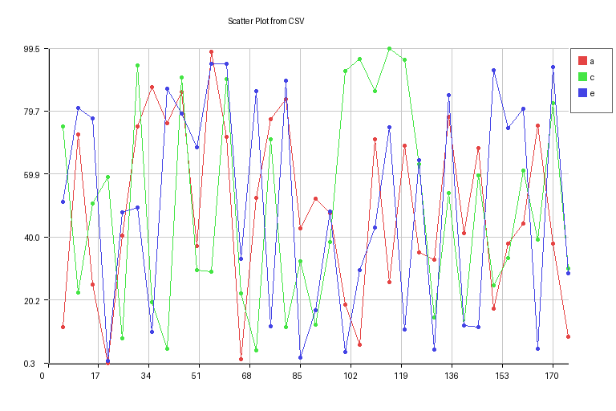

# csv2graph (Python)

A Python command-line tool that generates scatter plots from CSV files.



## Features

- Creates scatter plots from specified columns in CSV files
- Supports X-axis range specification, image size adjustment, and data thinning
- Automatically handles cases where X-axis values are not included in the CSV

## Requirements

- Python 3.x

## Installation

### Using a Virtual Environment (Recommended)

It's recommended to use a virtual environment to avoid dependency conflicts:

```bash
# Create a virtual environment
python -m venv venv

# Activate the virtual environment
# On Windows:
venv\Scripts\activate
# On macOS/Linux:
source venv/bin/activate

# Install required libraries
pip install -r requirements.txt
```

### Direct Installation

If you prefer not to use a virtual environment, you can install dependencies directly:

```bash
pip install -r requirements.txt
```

## Usage

```bash
python csv2graph.py --data CSV_FILE_PATH --columns SERIES1,SERIES2 [options]
```

### Options

| Option      | Description                               | Default Value | Example       |
|-------------|-------------------------------------------|---------------|---------------|
| --data      | Path to CSV file                          | Required      | ./data.csv    |
| --range     | Maximum value for X-axis                  | Optional      | 100           |
| --columns   | Comma-separated list of columns to plot   | Required      | a,b,c         |
| --size      | Output image size (WIDTHxHEIGHT)          | 768x512       | 800x600       |
| --skip      | Data thinning interval (every Nth element)| 1             | 2             |
| --xdata     | Whether X-axis values are included in CSV | false         | true          |
| --out       | Output image filename                     | scatter_plot.png | mygraph.png |
| --xscale    | Map X-axis values to specified range      | Optional      | 0,100         |

## Examples

```bash
# Plot all data
python csv2graph.py --data ./sample.csv --columns a,c,e --size 800x600 --skip 2 --xdata true --out output.png

# Plot up to a specific range
python csv2graph.py --data ./sample.csv --range 50 --columns a,c,e --out output.png

# Map X-axis values to a specific range
python csv2graph.py --data ./sample.csv --columns a,c,e --xscale 0,100 --out output.png
```

## CSV File Examples

The tool supports CSV files in the following format:

```csv
_,a,b,c,d
1,10,15,20,25
2,12,18,22,28
3,14,20,25,30
4,16,22,28,32
5,18,25,30,35
```

In this CSV file:
- The first column contains X-axis values (when `--xdata true` is specified)
- Subsequent columns contain data for each series
- Values are comma-separated
- A header row is required

### CSV File Example Without X-axis Data

If X-axis data is not included, you can use a CSV file in this format:

```csv
a,b,c,d
10,15,20,25
12,18,22,28
14,20,25,30
16,22,28,32
18,25,30,35
```

In this case, X-axis values will automatically be assigned as sequential numbers starting from 1 (when `--xdata` is not specified or `--xdata false` is specified)

### Installing as a Command-Line Tool

To make `csv2graph` available as a command that can be run from anywhere (while your virtual environment is active), you can install it using the provided `setup.py`:

```bash
# With your virtual environment activated
pip install -e .
```

This installs the package in "development mode" (or "editable mode"), which means:
- The `csv2graph` command becomes available anywhere in your environment
- Any changes you make to the code will be immediately available without reinstalling
- You can run it simply by typing `csv2graph` followed by arguments

To verify the installation worked, run:

```bash
csv2graph --help
```

Now you can use the tool from any directory without specifying the full path to the script:

```bash
# Run from any directory
csv2graph --data ./data.csv --columns a,b,c --out output.png
```

## License

Unilicense